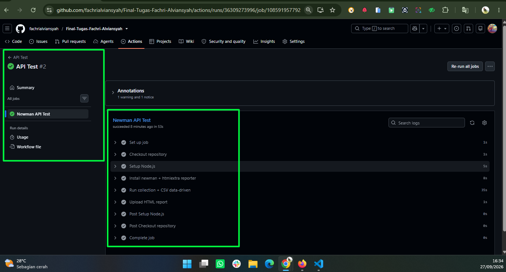
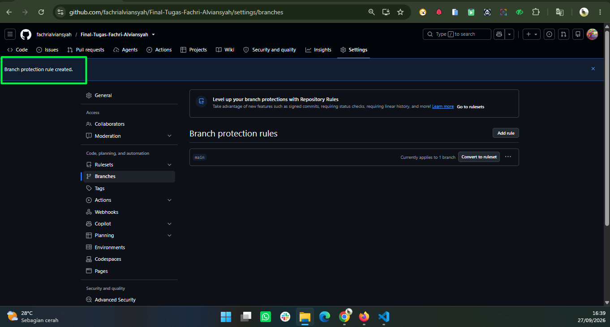
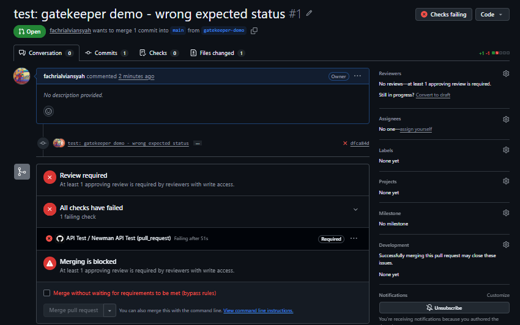

# Script Labs API Testing (Postman + Newman + GitHub Actions)

Final assignment API testing untuk website **https://labs.hendri.me**.
Isinya: Postman collection (login + CRUD `/api/labs`), data-driven testing dengan CSV,
dan pipeline GitHub Actions yang otomatis menjalankan test setiap push / pull request ke `main`.

> **Catatan penting:** frontend ada di `https://labs.hendri.me`, tapi **API-nya ada di
> `https://api-script-labs.hendri.me`**. Kalau request dikirim ke `labs.hendri.me/api/...`
> hasilnya `404 NOT_FOUND` (Vercel). Base URL ini disimpan di variable `{{base_url}}`.

---

## 1. Struktur Folder

```
.
├── .github/workflows/api-test.yml               # pipeline GitHub Actions
├── postman/
│   ├── labs-api.postman_collection.json         # collection (14 request)
│   ├── labs.postman_environment.example.json    # CONTOH environment (di-commit)
│   └── labs.postman_environment.json            # environment ASLI (di-ignore, buat sendiri)
├── data/labs-data.csv                           # data-driven testing (7 skenario)
├── reports/                                     # hasil report HTML (di-ignore)
├── .gitignore
└── README.md
```

## 2. Isi Collection

| Folder | Request | Expected |
|---|---|---|
| 01 Auth | Login - Valid (Standard User) → **simpan `token`** | 200, token JWT |
| | Login - Valid (Admin) | 200, `role = admin` |
| | Login - Negative (Wrong Password) | 401, `AUTH_FAILED` |
| | Login - Negative (Locked User) | 403, `USER_LOCKED` |
| 02 Labs CRUD | Get All Labs | 200, array |
| | Create Lab → **simpan `lab_id`** | 201, title/description = input |
| | Get Lab Detail | 200, data = saat create |
| | Update Lab | 200, title/description baru |
| | Delete Lab | 200 |
| | Get Lab After Delete | 404, `lab not found` |
| 03 Negative Cases | Get All Labs Without Token | 401, `No token provided` |
| | Create Lab Invalid Body (tanpa title) | 400/422, `Title is required` |
| 04 Data Driven | Create Lab - Data Driven (CSV) | sesuai kolom `expected_status` |

**Alur autentikasi**
- Auth diset di **level collection**: `Bearer Token` = `{{token}}`. Semua request mewarisinya.
- Folder `01 Auth` dan request "Without Token" diset **No Auth**.
- Request login menyimpan token otomatis: `pm.collectionVariables.set("token", json.data.token)`.
- Create Lab menyimpan id otomatis: `pm.collectionVariables.set("lab_id", json.data.id)`,
  lalu dipakai di URL `{{base_url}}/api/labs/{{lab_id}}`.

**Assertion di setiap request**
- *Status code* dan *response body* (field ada, tipe data, nilai = input) → di tab **Tests** tiap request.
- *Response time* (< `max_response_time`, default 3000 ms) dan *Content-Type JSON* → di tab
  **Tests level collection**, jadi otomatis berlaku untuk SEMUA request.
  Ubah batasnya di variable collection `max_response_time` (misal `2000`).
  Default dibuat 3000 ms karena login kadang ±1,6 detik. Di CI batasnya dinaikkan ke **5000 ms**
  (`--env-var "max_response_time=5000"`) karena runner GitHub ada di Amerika sehingga request lebih
  lambat; tanpa ini pipeline sempat gagal acak karena response time > 3000 ms.

### Struktur request/response API (sudah dicek langsung)

| Endpoint | Request body | Response penting |
|---|---|---|
| `POST /api/auth/login` | `{"email","password"}` | 200 `{success:true, data:{token, user:{id,email,role,status}}}` |
| login gagal | | 401 `{success:false, error:{message, code:"AUTH_FAILED"}}` / 403 `code:"USER_LOCKED"` |
| `GET /api/labs` | – | 200 `{success:true, data:[{id,title,description,user_id,created_at,updated_at}]}` |
| `POST /api/labs` | `{"title","description"}` | 201 `{success:true, data:{id:<number>,...}, message:"Lab added successfully"}` |
| `GET/PUT/DELETE /api/labs/:id` | PUT: `{"title","description"}` | 200; kalau tidak ada: 404 `error.message:"lab not found"` |
| tanpa token | | 401 `{"message":"No token provided"}` |
| body tidak valid | | 400 `error.message:"Validation Error: ..."` |

Aturan validasi yang ditemukan: title wajib, tidak boleh kosong/spasi saja, maks **255 karakter**;
description wajib dan tidak boleh kosong; password login minimal 6 karakter (kalau kurang → 400, bukan 401);
tag HTML seperti `<script>` dibuang oleh server (makanya tidak dipakai di CSV).

**Kalau suatu hari API berubah**, cek ulang strukturnya dengan salah satu cara:
1. **DevTools** – buka https://labs.hendri.me → `F12` → tab **Network** → filter **Fetch/XHR** → login /
   tambah / edit / hapus lab → klik request (`login`, `labs`) → lihat tab **Headers** (URL, method),
   **Payload** (body yang dikirim) dan **Response** (nama field, format id, format error).
2. **Postman** – kirim request manual, lihat tab **Body** response, lalu sesuaikan assertion di tab **Tests**
   (misal kalau `data.token` berubah jadi `access_token`).

---

## 3. Data-Driven Testing (`data/labs-data.csv`)

| scenario | title | expected_status |
|---|---|---|
| valid_normal | `API Testing Lab` | 201 |
| valid_special_chars | `Lab !@#$%^&*()_+-=[]{}\|;:',./?` + description berisi `"kutip"` | 201 |
| edge_title_255_chars | 255 × `A` (batas maksimal) | 201 |
| invalid_title_256_chars | 256 × `A` | 400 |
| invalid_empty_title | (kosong) | 400 |
| invalid_whitespace_title | `"   "` (spasi saja) | 400 |
| invalid_empty_description | description kosong | 400 |

- Pre-request script membaca baris CSV lewat `pm.iterationData` lalu membuat body dengan
  `JSON.stringify` (aman untuk karakter spesial).
- Test membandingkan status dengan kolom `expected_status` → assertion **dinamis**.
- Data yang berhasil dibuat (201) langsung dihapus lagi (cleanup) supaya akun tidak penuh sampah.
- Newman / Runner menjalankan **seluruh collection sekali per baris CSV** (7 iterasi × 14 request).

---

## 4. Prasyarat

- [Postman](https://www.postman.com/downloads/) (desktop)
- [Node.js](https://nodejs.org/) versi 18+ (cek: `node -v`)
- Newman + reporter HTML:
  ```bash
  npm install -g newman newman-reporter-htmlextra
  ```
- Git + akun GitHub

## 5. Setup Kredensial Lokal

Kredensial **tidak** ditulis di collection maupun YAML. Buat environment lokal dari file contoh:

```bash
cp postman/labs.postman_environment.example.json postman/labs.postman_environment.json
```
(PowerShell: `Copy-Item postman/labs.postman_environment.example.json postman/labs.postman_environment.json`)

Buka `postman/labs.postman_environment.json`, ganti semua `ISI_...` dengan akun demo:

| Variable | Isi |
|---|---|
| `login_email` / `login_password` | akun Standard User |
| `admin_email` / `admin_password` | akun Admin |
| `locked_email` / `locked_password` | akun Locked User |

File ini sudah masuk `.gitignore` sehingga **tidak ikut ter-push**. Cek dengan `git status`,
file ini tidak boleh muncul di daftar.

## 6. Cara Run Lokal

### a. Postman (Collection Runner)
1. **Import** → pilih `postman/labs-api.postman_collection.json` dan `postman/labs.postman_environment.json`.
2. Pilih environment **Script Labs - Local** di pojok kanan atas.
3. Klik kanan collection → **Run collection**.
4. Di bagian **Data** klik **Select File** → pilih `data/labs-data.csv` (preview akan menampilkan 7 iterasi).
5. Klik **Run Script Labs API Testing** → semua test harus hijau.

> Menjalankan satu request dengan tombol **Send** juga bisa. Jalankan `Login - Valid (Standard User)`
> dulu supaya `token` terisi, lalu `Create Lab` sebelum Detail/Update/Delete supaya `lab_id` terisi.
> Request Data Driven tanpa CSV memakai data default (valid).

### b. Newman (terminal)

Git Bash / macOS / Linux:
```bash
newman run postman/labs-api.postman_collection.json \
  -e postman/labs.postman_environment.json \
  -d data/labs-data.csv \
  -r cli,htmlextra \
  --reporter-htmlextra-export reports/api-test-report.html
```

PowerShell (satu baris):
```powershell
newman run postman/labs-api.postman_collection.json -e postman/labs.postman_environment.json -d data/labs-data.csv -r cli,htmlextra --reporter-htmlextra-export reports/api-test-report.html
```

- `-e` = file environment (kredensial), `-d` = file data CSV, `-r` = reporter.
- Buka `reports/api-test-report.html` di browser untuk melihat report.
- Hasil saat dicoba: **7 iterasi, 94 request, 458 assertion, 0 gagal** (±50 detik).

---

## 7. GitHub: Repo, Secrets, dan Collaborator

### a. Buat repo & push
1. GitHub → **New repository** → nama misal `script-labs-api-testing` → pilih **Private** →
   jangan centang "Add README" → **Create repository**.
2. Di folder project:
   ```bash
   git init
   git branch -M main
   git add .
   git status          # pastikan labs.postman_environment.json dan reports/ TIDAK ada
   git commit -m "feat: postman collection, csv data-driven, github actions"
   git remote add origin https://github.com/<username>/script-labs-api-testing.git
   git push -u origin main
   ```

### b. Tambah GitHub Secrets
Repo → **Settings** → **Secrets and variables** → **Actions** → **New repository secret**, buat 6 secret:

| Secret | Isi |
|---|---|
| `LOGIN_EMAIL` / `LOGIN_PASSWORD` | Standard User |
| `ADMIN_EMAIL` / `ADMIN_PASSWORD` | Admin |
| `LOCKED_EMAIL` / `LOCKED_PASSWORD` | Locked User |

Workflow meneruskannya ke newman dengan `--env-var "login_email=$LOGIN_EMAIL"` dst.
Nilai secret otomatis disensor (`***`) di log Actions.

> Kalau push pertama terjadi **sebelum** secrets dibuat, run pertama akan merah (login gagal).
> Setelah secrets dibuat: tab **Actions** → pilih run → **Re-run all jobs**
> (atau **Run workflow** karena ada `workflow_dispatch`).

### c. Invite mentor
Repo → **Settings** → **Collaborators** (atau *Collaborators and teams*) → **Add people** →
masukkan username/email GitHub mentor → pilih repo → **Add**. Mentor harus menerima undangan via email.

---

## 8. Pipeline (`.github/workflows/api-test.yml`)

- Trigger: `push` dan `pull_request` ke `main` (+ `workflow_dispatch` untuk run manual).
- Step: checkout → setup Node.js 20 → `npm install -g newman newman-reporter-htmlextra` →
  jalankan collection + CSV → upload `reports/api-test-report.html` sebagai artifact **api-test-report**.
- Newman keluar dengan **exit code 1** jika ada assertion gagal → step merah → job **gagal**.
- Upload artifact memakai `if: always()` sehingga report tetap tersedia walaupun test gagal.

Melihat report: tab **Actions** → klik run → bagian **Artifacts** di bawah → download
`api-test-report` → extract zip → buka file `.html`.

---

## 9. Skenario Gatekeeper

Tujuan: membuktikan pipeline **memblokir** perubahan yang merusak test.

### a. Aktifkan branch protection (lakukan sekali)
> Status check baru bisa dipilih setelah workflow pernah jalan minimal sekali di repo.

1. Repo → **Settings** → **Branches** → **Add branch protection rule**
   (atau **Add classic branch protection rule**).
2. *Branch name pattern*: `main`.
3. Centang **Require a pull request before merging**.
4. Centang **Require status checks to pass before merging** → di kotak pencarian ketik
   `Newman API Test` → pilih check tersebut.
5. (Opsional) centang **Require branches to be up to date before merging**.
6. **Create** / **Save changes**.

> Alternatif tampilan baru: **Settings → Rules → Rulesets → New branch ruleset** → target `main` →
> aktifkan *Require a pull request* dan *Require status checks to pass* → tambah check `Newman API Test`.

### b. Buat PR yang sengaja rusak
```bash
git checkout -b gatekeeper-demo
```
Edit `data/labs-data.csv`, baris `valid_normal`: ubah `expected_status` dari `201` menjadi `200`
(API sebenarnya membalas 201, jadi assertion pasti gagal).
```bash
git add data/labs-data.csv
git commit -m "test: gatekeeper demo - wrong expected status"
git push -u origin gatekeeper-demo
```
Di GitHub klik **Compare & pull request** → base `main` ← compare `gatekeeper-demo` → **Create pull request**.

Hasil yang diharapkan:
- Check **Newman API Test** merah ❌, log berisi `AssertionError [valid_normal] Status code = 200`.
- Tombol merge terkunci: *"Merging is blocked – Required status check ... has not succeeded"*.

### c. Kembalikan ke hijau
Pilih salah satu:
- **Perbaiki di branch yang sama** (paling bagus untuk bukti): ubah lagi `200` → `201`, commit & push →
  check jalan ulang → hijau ✅ → tombol merge aktif. (Boleh di-merge atau cukup di-close.)
  ```bash
  git revert HEAD      # atau edit manual lalu commit
  git push
  ```
- **Close PR** tanpa merge lalu hapus branch `gatekeeper-demo`. `main` tetap hijau karena perubahan
  rusak tidak pernah masuk.

---

## 10. Screenshot untuk Bukti Penilaian

Simpan di folder `docs/screenshots/` lalu tampilkan di bawah ini.

1. Tab **Actions** dengan run di `main` berstatus **hijau** ✅.
2. Detail run hijau: step *Run collection + CSV data-driven* terbuka, tabel ringkasan newman (0 failed).
3. Halaman PR `gatekeeper-demo` dengan check **merah** ❌ dan pesan *Merging is blocked*.
4. Log run merah yang menunjukkan `AssertionError` (baris assertion yang gagal).
5. PR yang sama setelah diperbaiki → check **hijau** ✅.
6. Halaman **Settings → Branches** yang menunjukkan branch protection rule untuk `main`.
7. Bagian **Artifacts** berisi `api-test-report` + isi report htmlextra yang dibuka di browser.
8. Halaman **Settings → Secrets and variables → Actions** (nama secret terlihat, nilainya tidak).
9. Postman Collection Runner dengan CSV (7 iterasi, semua passed).
10. Halaman **Collaborators** yang menunjukkan mentor sudah di-invite.

### Hasil

**Actions hijau** – run `API Test` di `main`, job *Newman API Test* sukses



**Branch protection** – rule untuk branch `main` sudah dibuat



**PR gatekeeper merah** – `expected_status` sengaja diubah 201 → 200, check *Newman API Test* gagal, merge diblokir



**PR kembali hijau** – _menyusul_

**Report artifact** – _menyusul_
